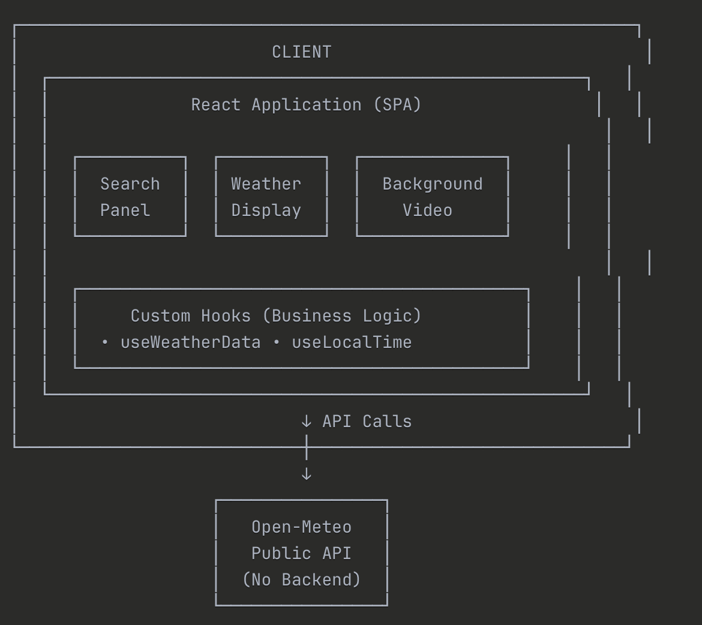

## Design Inspiration

The entire visual identity and user experience were intentionally crafted to align with Megazone Cloud's brand aesthetic:

Day theme: Clean slate grays with blue accents
Night theme: Deep blacks with cyan/pink neon accents (cyberpunk aesthetic)

### Animated Backgrounds: Integrated actual video assets from Megazone Cloud's landing page

Day theme: the video on Megazone's website for their AI native section
Night theme: the video on Megazone's website used in the Cloud Native section
Credit: Videos sourced from megazone.com

### Logo Design: Created a custom logo inspired by Megazone's 

Geometric shapes suggesting both clouds and technology
Adaptive styling (inverted colors for night theme)

## Architecture

### Core Principles

1. Separation of Concerns: Components (UI) vs. Hooks (Logic) vs. Utils (Pure Functions)
2. Single Responsibility: Each module has one clear purpose
3. Composition Over Inheritance: Building complex UIs from simple components
4. Declarative Programming: React's declarative nature for predictable UI states

## API 

I used **Open-Meteo** (10k requests/day) for this assignment, where rate limits would not matter much and setup complexity would be a constraint meaningful for me. Open-Meteo has no API key, reducing the setup time required and the need for storage and rotation of API key environment variables for anyone interested to install and run this project locally. But if I were to scale it, I would use the **weatherapi** API suggested by the instructions document (33k requests/day). For most production or commercial environments, and for generic weather data, I would use weatherapi.

If I wanted to make a weather app for more sophisticated forecasting or past-informed insights, I would still use Open-Meteo because it has better marine weather and air quality data, bigger ranges of both forcast and historical data to perform any analyses/extend any insight.

## Deployment

Currently, the app is deployed on Vercel due to its fast setup, seamless Git-based deployment, and cost-effectiveness. For a production-ready or commercial release, Vercel remains a strong choice because the weather app is predominantly front-end focused, with minimal backend, storage, or authentication requirements. Its serverless functions and global CDN provide low-latency API calls, which is well-suited for fetching weather data efficiently.

If the app were to evolve to require a more sophisticated backend, including persistent storage, user authentication, or complex APIs, I would consider migrating to something with more robust support like AWS Amplify. It would also enable me to have more granular control over technical infrastructure.

