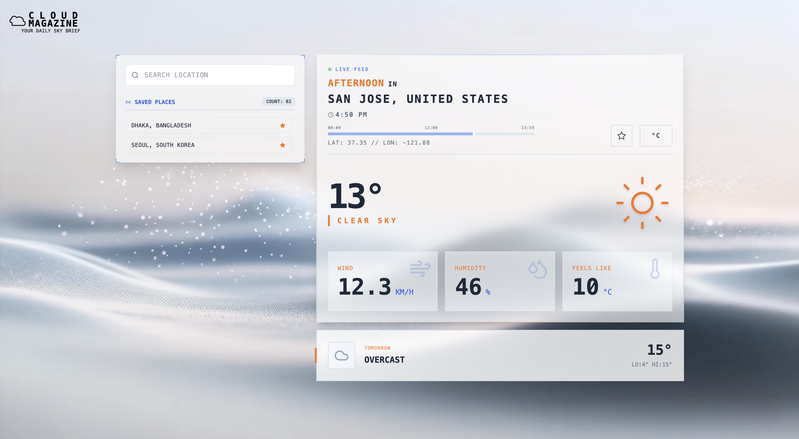

# CloudMagazine - Weather App

A modern, futuristic-themed weather application built with React, Vite, and Tailwind CSS. Takes design elements from Megazone Cloud including the logo, title and day (Megazone AIR animation) and night (Cloud Native animation) backgrounds. Features real-time weather data, temperature unit toggling, favorites management, and a sleek day/night theme.




## Tech Stack

- **React 18** - Frontend library
- **Vite 5** - Fast build tool
- **Tailwind CSS 3** - Utility-first CSS framework
- **Lucide React** - Icon library
- **Open-Meteo API** - Free weather data (no API key required)
- **Vercel** - fast deployment that integrates seamlessly with Git and Vite

## Features

- 🌍 Search weather by city name (Select among the top 5 search results to disambiguate between locations)
- ⭐ Save favorite locations
- 🌡️ Toggle between Celsius and Fahrenheit
- 🌙 Automatic day/night theme switching
- 📊 Real-time weather data (temperature, humidity, wind speed, weather conditions)
- 📅 Tomorrow's forecast
- 📱 Responsive design

## Local Deployment

### Prerequisites

- Node.js 16+ and npm installed

### Installation

Installation

1. Clone the repository:

```bash
git clone https://github.com/prawnteya/CloudMagazine.git
cd CloudMagazine
```

2. Install dependencies:

```bash
npm install
```

3. Start development server:

```bash
npm run dev
```

4. Open your browser:
```
   http://localhost:5173
```

### Building for Production

Create a production build:

```bash
npm run build
```

Preview the production build:

```bash
npm run preview
```

## Project Structure


## 📁 Project Structure
```
CloudMagazine/
├── src/
│   ├── components/           # React components
│   │   ├── BackgroundVideo.jsx    # Video background with theme support
│   │   ├── LoadingScreen.jsx      # Loading state UI
│   │   ├── SearchPanel.jsx        # Location search + favorites
│   │   ├── WeatherDisplay.jsx     # Main weather card
│   │   └── TomorrowForecast.jsx   # Next day preview
│   │
│   ├── hooks/                # Custom React hooks
│   │   ├── useLocalTime.js        # Local time calculation & day phase
│   │   └── useWeatherData.js      # Weather API integration
│   │
│   ├── utils/                # Pure utility functions
│   │   ├── weatherHelpers.js      # Weather code mappings
│   │   └── temperatureUtils.js    # Temperature conversions
│   │
│   ├── constants/            # Configuration & static data
│   │   ├── weatherCodes.js        # WMO weather code definitions
│   │   └── styles.js              # Theme style configurations
│   │
│   ├── App.jsx              # Main application component
│   ├── main.jsx             # React entry point
│   └── index.css            # Global styles & Tailwind imports
│
├── public/                  # Static assets
├── index.html               # HTML template
├── package.json             # Dependencies & scripts
├── package-lock.json        # Locked dependency versions
├── vite.config.js          # Vite configuration
├── tailwind.config.js      # Tailwind customization
├── postcss.config.js       # PostCSS configuration
├── vercel.json             # Vercel deployment config
├── .gitignore              # Git ignore rules
├── README.md               # This file
└── DESIGN.md               # Design considerations
```

## API

The app uses the free **Open-Meteo API** (https://open-meteo.com) for weather data:

- **Geocoding API** - Convert city names to coordinates
- **Weather Forecast API** - Get current and future weather

No API key or authentication required.

## Browser Support

Works on all modern browsers (Chrome, Firefox, Safari, Edge)

## License

MIT
